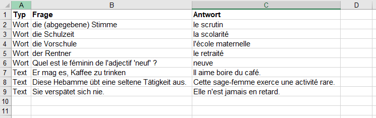
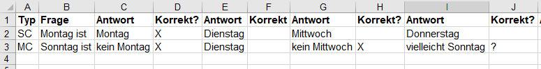
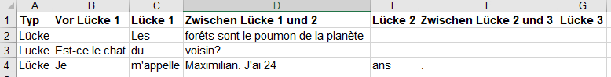

# Beschreibung des Excelformats für Wuekabel

Wuekabel kann Karteikarten aus einer Excel-Datei (neuere Version von Excel, Dateien mit der Endung `.xlsx)`
importierten. Dazu muss die Datei folgendes *vorläufige* Format einhalten:

Die Datei besteht aus 3 Arbeitsblättern mit beliebigem Namen, aber in **der hier angegebenen Reihenfolge**.
Die erste Zeile jedes Arbeitsblatts kann für die Überschriften der Spalten benutzt werden und __wird ignoriert__!

## 1. Arbeitsblatt: Textuelle Karteikarten

In diesem Arbeitsblatt werden in den Spalten `A`, `B` und `C` Karteikarten definiert, bei denen eine Übersetzung
eingegeben werden soll.

* Spalte `A` beinhaltet den Typ der Karte. Dieser kann in `Wort` oder `Text` sein. Bei `Wort` wird ein reiner Abgleich
vorgenommen, bei `Text` bekommt der Nutzer die falschen Zeichen in seiner Lösung angezeigt. Daher eignet sich `Text`
vor allem für längere Übersetzungen.

* Spalte `B` beinhaltet den zu übersetzenden Text

* Spalte `C` beinhaltet die Übersetzung

__Beispiel__:

\newpage

## 2. Arbeitsblatt: Auswahlfragen

In diesem Arbeitsblatt werden Einfach- oder Mehrfachauswahlfragen definiert. Für jede Frage werden mehrere (mindestens 2)
Antworten definiert, die korrekt, optional oder falsch sind. Bei der Bearbeitung werden die Antwort(en) durch Anklicken
ausgewählt, die für korrekt gehalten werden. Zur erfolgreichen Bearbeitung müssen alle korrekten
Antworten gewählt und alle falschen nicht gewählt sein.
 
* Spalte `A` beinhaltet wieder den Typ der Frage. Dieser kann `SC` für Einfachauswahl oder `MC` für Mehrfachauswahl
sein.

* Spalte `B` beinhaltet die Frage

* Die folgenden Spalten gehören paarweise zusammen (also `C` und `D`, `E` und `F`, `G` und `H`, etc.) und definieren
jeweils eine Antwortmöglichkeit und die Korrektheit der Antwort. Es können beliebig viele Antwort-Korrektheit-Paare
angegeben werden. Für die Zelle, die die Korrektheit angibt, gibt es folgende Möglichkeiten:

    * Eine leere Zelle steht für eine falsche Antwort
    * Ein `?` in der Zelle steht für eine optionale Antwort
    * Alles andere (Konvention: `X`) in der Zelle steht für eine korrekte Antwort

\newpage

## 3. Arbeitsblatt: Lückentexte

In diesem Arbeitsblatt werden Fragen mit (beliebig vielen) Lücken zum Ausfüllen definiert. Alle Spalten ab einschlißlich
`D` sind optional.

* Spalte `A` beinhaltet den Text der Frage *vor* der ersten Lücke

* Spalte `B` beinhaltet die Lösung der ersten Lücke

* Spalte `C` beinhaltet den Text der Frage zwischen Lücke 1 und 2

* Spalten `D` und `E` beinhalten die Lösung der zweiten Lücke und den Text nach der zweiten Lücke

* Spalten `F` und `G` beinahlten die Lösung der dritten Lücke und den Text nach der dritten Lücke

* ...

